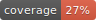

# gulpfile.basics

Provides basic functionality such as watch, test, coverage, shrinkwrap, release and publish

## Installation

    npm install gulp --save-dev
    npm install gulpfile.basics --save-dev

## Usage

Edit your `gulpfile.js` file and paste the following in:

    /* jshint node:true */
    /* jshint expr:true*/
    /* global require */
    'use strict';
    
    var gulp = require('gulpfile.basics');

## Provided Tasks

### default

Will start the `watch` task

    gulp

### watch

Any `js` or `json` file change in the package directory will trigger a `lint` check and run the tests

    gulp watch
    
### test

The [Mocha Test Framework](http://mochajs.org/) has to be used and tests have to be in a `test` directory and the file names must use match `filename.spec.js`.

    gulp test

### coverage

Uses the [JS Code Coverage Tool Istanbul](https://github.com/gotwarlost/istanbul), run the tests and generates three different report formats:

- [LCOV](http://ltp.sourceforge.net/coverage/lcov.php) (stored in `coverage` folder)
- [Cobertura](http://cobertura.github.io/cobertura/) (stored in `coverage` folder)
- JSON (stored in `report` folder)

The Cobertura report is used to generate a coverage badge that you can use in your README file

    

On Github you have to use the following:

    

### shrinkwrap

Generates a `npm-shrinkwrap.json` file without any `resolve` property

    gulp shrinkwrap

### release

Tests, checks coverage, shrinkwarps, bumps, commits, tags and pushes a new version of the package to the repository. This tasks will only commit following files: ./package.json, ./gulpfile.js, ./npm-shrinkwrap.json and ./reports/**/*
Bump target is per default the patch number, you can pass following command line arguments to bump to minor or major versions:

    gulp release
    gulp release --patch (default)
    gulp release --minor
    gulp release --major

### publish

Releases a new version and publish the package to the npm repository

    gulp publish
    gulp publish --patch (default)
    gulp publish --minor
    gulp publish --major

    
--------------
Copyright (c) 2015 Luscus (luscus.redbeard@gmail.com)

Permission is hereby granted, free of charge, to any person obtaining a copy of this software and associated documentation files (the "Software"), to deal in the Software without restriction, including without limitation the rights to use, copy, modify, merge, publish, distribute, sublicense, and/or sell copies of the Software, and to permit persons to whom the Software is furnished to do so, subject to the following conditions:

The above copyright notice and this permission notice shall be included in all copies or substantial portions of the Software.

THE SOFTWARE IS PROVIDED "AS IS", WITHOUT WARRANTY OF ANY KIND, EXPRESS OR IMPLIED, INCLUDING BUT NOT LIMITED TO THE WARRANTIES OF MERCHANTABILITY, FITNESS FOR A PARTICULAR PURPOSE AND NONINFRINGEMENT. IN NO EVENT SHALL THE AUTHORS OR COPYRIGHT HOLDERS BE LIABLE FOR ANY CLAIM, DAMAGES OR OTHER LIABILITY, WHETHER IN AN ACTION OF CONTRACT, TORT OR OTHERWISE, ARISING FROM, OUT OF OR IN CONNECTION WITH THE SOFTWARE OR THE USE OR OTHER DEALINGS IN THE SOFTWARE.
